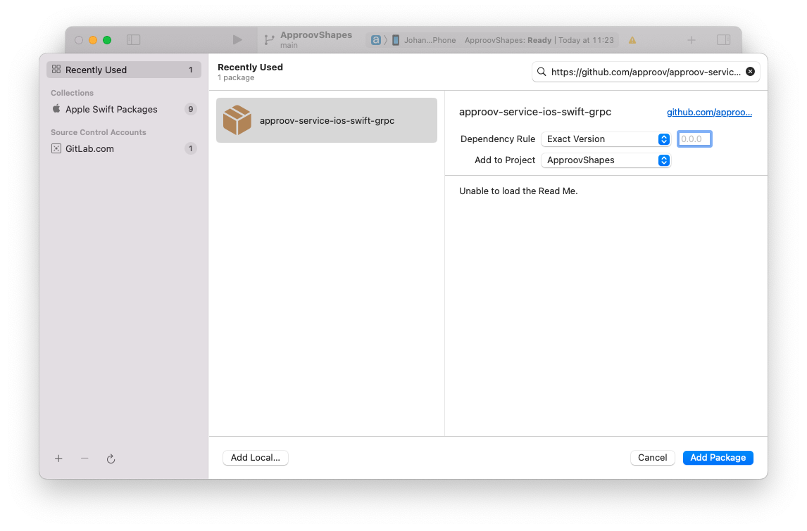

# Approov Quickstart: iOS Swift GRPC (Google Remote Procedure Call)

This quickstart is written specifically for native iOS apps that are written in Swift, making API calls using [GRPC-Swift](https://github.com/grpc/grpc-swift) that you wish to protect with Approov. If this is not your situation, then please check if there is a more relevant quickstart guide available.

This quickstart provides the basic steps for integrating Approov into your app. A more detailed step-by-step guide using a [Shapes App Example](https://github.com/approov/quickstart-ios-swift-grpc/blob/master/SHAPES-EXAMPLE.md) is also available.

To follow this guide you should have received an onboarding email for a trial or paid Approov account.

Note that the minimum requirement is iOS 10. You cannot use Approov in apps that support iOS versions older than this.

## ADDING APPROOV SERVICE DEPENDENCY
The Approov integration is available via the [`Swift Package Manager`](https://developer.apple.com/documentation/swift_packages/adding_package_dependencies_to_your_app). This allows inclusion into the project by simply adding a dependency on the `ApproovGRPC` package in Xcode through the `File -> Add Packages...` menu item or in the project's `Package Dependency` section. In the search box of the add packages dialog enter the url of the git repository `https://github.com/approov/approov-service-ios-swift-grpc.git`, then choose `Exact Version` and use the latest available option, which should be selected for you.



The `ApproovGRPC` package is actually an open source wrapper layer that allows you to easily use Approov with GRPC-Swift. This has a further dependency to the closed source [Approov SDK](https://github.com/approov/approov-ios-sdk).

## USING APPROOV SERVICE
The `ApproovClientConnection` class mimics the interface and functionality of the `ClientConnection` class provided by GRPC-Swift, but also sets up pinning for the GRPC channel created by an `ApproovClientConnection.Builder`.

The Approov SDK wrapper class, `ApproovService`, needs to be initialized before using any `ApproovClientConnection` object. The `<enter-your-config-string-here>` is a custom string that configures your Approov account access. This will have been provided in your Approov onboarding email (it will be something like `#123456#K/XPlLtfcwnWkzv99Wj5VmAxo4CrU267J1KlQyoz8Qo=`).

The simplest way to use the `ApproovClientConnection` class is to find and replace all the `ClientConnection` with `ApproovClientConnection`:

```swift
try! ApproovService.initialize("<enter-your-config-string-here>")
let builder = ApproovClientConnection.usingTLSBackedByNIOSSL(on: group!)
```

You can then create secure pinned GRPC channels by using the returned builder instead of the usual `ClientConnection.Builder`:

```swift
let channel = builder.connect(host: hostname, port: port)
```

Approov-enable GRPC clients by adding a `ClientInterceptor` factory. The `ClientInterceptor` factory should return an `ApproovClientInterceptor` for any GRPC call that requires to be protected with Approov. The `ApproovClientInterceptor` adds an `Approov-Token` header to a GRPC request and may also substitute header values when using secrets protection.

```swift
// Provide the channel to the generated client.
client = Your_YourClient(channel: channel, interceptors: ClientInterceptorFactory(hostname: hostname))
```

The required `ClientInterceptorFactory` looks similar to this template and must be implemented specifically to match the code generated by the GRPC `protoc` compiler for your protocol definitions (.proto files). In the example below all types starting with`Your_` would have been automatically generated. Note that an ApproovInterceptor needs to be returned only for GRPCs that should be protected with an Approov token.

```swift
import ApproovGRPC
import Foundation
import GRPC

// Example client interceptor factory to show how to create the required ClientInterceptorFactory for a specific
// ClientInterceptorFactoryProtocol for use with Approov.
class ClientInterceptorFactory: Your_YourClientInterceptorFactoryProtocol {

    // hostname/domain for which to add an Approov token to protected GRPC requests
    let hostname: String

    init(hostname: String) {
        self.hostname = hostname
    }

    /// - Returns: Interceptors to use when invoking a GRPC that does not require Approov protection.
    func makeUnprotectedInterceptors() -> [ClientInterceptor<Your_UnprotectedRequest, Your_UnprotectedReply>] {
        return []
    }

    /// - Returns: Interceptors to use when invoking a GRPC that requires Approov protection.
    func makeProtectedInterceptors() -> [ClientInterceptor<Your_ProtectedRequest, Your_ProtectedReply>] {
        return [ApproovClientInterceptor<Your_ProtectedRequest, Your_ProtectedReply>(hostname: hostname)]
    }
}
```

## ERROR MESSAGES
The `ApproovService` functions may throw specific errors to provide additional information:

* `permanentError` might be due to a feature not being enabled through using the command line
* `rejectionError` an attestation has been rejected, the `ARC` and `rejectionReasons` may contain specific device information that would help troubleshooting
* `networkingError` generally can be retried since it can be a temporary network issue
* `pinningError` is a certificate error
* `configurationError` a configuration feature is disabled or wrongly configured (e.g. attempting to initialize with different configuration from a previous initialization)
* `initializationFailure` the ApproovService failed to be initialized

## CHECKING IT WORKS
Initially you won't have set which API domains to protect, so the interceptor will not add anything. It will have called Approov though and made contact with the Approov cloud service. You will see logging from Approov saying `unknown URL`.

Your Approov onboarding email should contain a link allowing you to access [Live Metrics Graphs](https://approov.io/docs/latest/approov-usage-documentation/#metrics-graphs). After you have run your app with Approov integration you should be able to see the results in the live metrics within a minute or so. At this stage you could even release your app to get details of your app population and the attributes of the devices they are running on.

## NEXT STEPS
To actually protect your APIs there are some further steps. Approov provides two different options for protection:

* [API PROTECTION](https://github.com/approov/quickstart-ios-swift-grpc/blob/master/API-PROTECTION.md): You should use this if you control the backend API(s) being protected and are able to modify them to ensure that a valid Approov token is being passed by the app. An [Approov Token](https://approov.io/docs/latest/approov-usage-documentation/#approov-tokens) is short lived crytographically signed JWT proving the authenticity of the call.

* [SECRETS PROTECTION](https://github.com/approov/quickstart-ios-swift-grpc/blob/master/SECRETS-PROTECTION.md): If you do not control the backend API(s) being protected, and are therefore unable to modify it to check Approov tokens, you can use this approach instead. It allows app secrets, and API keys, to be protected so that they no longer need to be included in the built code and are only made available to passing apps at runtime.

Note that it is possible to use both approaches side-by-side in the same app, in case your app uses a mixture of 1st and 3rd party APIs.

See [REFERENCE](https://github.com/approov/quickstart-ios-swift-grpc/blob/master/REFERENCE.md) for a complete list of all of the `ApproovService` methods.

## BITCODE SUPPORT
In order to use a bitcode enabled Approov service, you can still use the swift package repository at `https://github.com/approov/approov-service-ios-swift-grpc.git` but append the `-bitcode` suffix to the required SDK version, i.e. you could use `3.1.1-bitcode` as a version in the Swift Package Manager window.
