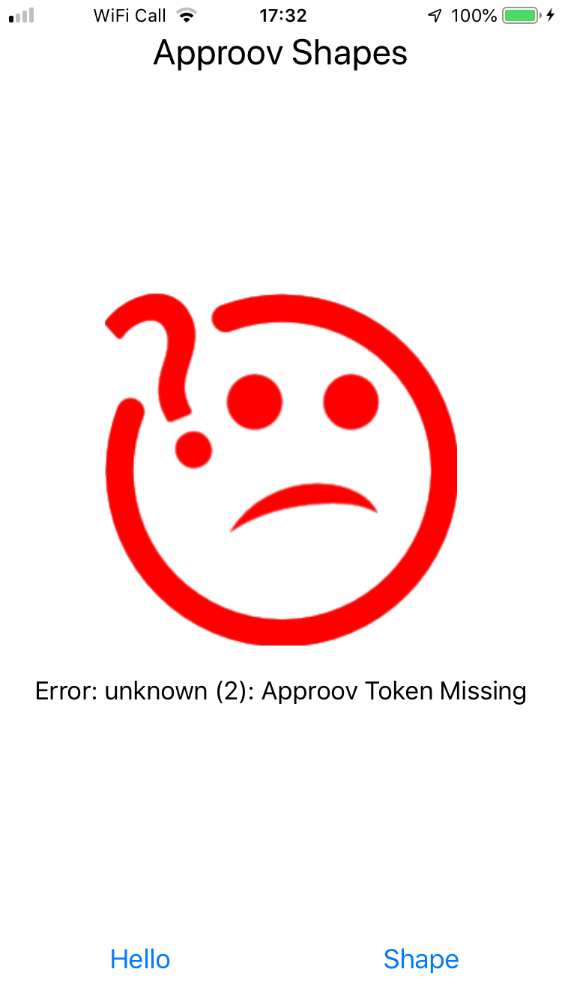

# Shapes Example

This quickstart is written specifically for native iOS apps that are written in Swift and use [GRPC-Swift](https://github.com/grpc/grpc-swift) for making the API calls that you wish to protect with Approov. This quickstart provides a step-by-step example of integrating Approov into an app using a simple `Shapes` example that shows a geometric shape based on a request to an API backend that can be protected with Approov.

## WHAT YOU WILL NEED
* Access to a trial or paid Approov account
* The `approov` command line tool [installed](https://approov.io/docs/latest/approov-installation/) with access to your account
* [Xcode](https://developer.apple.com/xcode/) version 13 installed (version 13.2.1 is used in this guide)
* The [protocol compiler](https://github.com/protocolbuffers/protobuf#protocol-compiler-installation), `protoc`, for Google's Protocol Buffers (version 3.18.0 is used in this guide) and the [Swift protoc plugins](https://github.com/grpc/grpc-swift#getting-the-protoc-plugins)
* The contents of this repo
* An Apple mobile device with iOS 10 or higher

## RUNNING THE SHAPES APP WITHOUT APPROOV

Open the `ApproovShapes.xcodeproj` project in the `shapes-app` folder using `File->Open` in Xcode. Ensure the `ApproovShapes` project is selected at the top of Xcode's project explorer panel.

Select your codesigning certificate in the `Signing & Capabilities` tab and run the application on your prefered device.


Once the application is running you will see two buttons:

<p>
    
</p>

Click on the `Hello` button and you should see this:

<p>
    
</p>

This checks the connectivity by connecting to `grpc.shapes.approov.io:50051` and making a `hello` remote procedure call. Now press the `Shape` button and you will see this:

<p>
    
</p>

This contacts `grpc.shapes.approov.io:50051` to get the name of a random shape. It receives the error `unknown(2):Approov Token Missing` because this endpoint is protected with an Approov token. Next, you will add Approov into the app so that it can generate valid Approov tokens and get shapes.

## ADD THE APPROOV SERVICE DEPENDENCY

Get the latest Approov integration by using the `swift package manager`. The repository located at `https://github.com/approov/approov-service-ios-swift-grpc.git` includes as a dependency the closed source Approov SDK and includes branches pointing to the relevant Approov SDK release versions. The approov-service-ios-swift-grpc is actually an open source wrapper layer that allows you to easily use Approov with GRPC. Install the dependency by selecting the `ApproovShapes` project in Xcode and then selecting `File->Add Packages`:


You will then have to select the relevant Approov SDK version you wish to use. To do so, select the `Exact Version` option and enter the SDK version, in this case `2.9.0`.
Once you click `Add Package` the last screen will confirm the package product and target selection:


Click `Add Package` again, the Approov SDK is now included as a dependency in your project.

## ENSURE THE SHAPES API IS ADDED

In order for Approov tokens to be generated for `grpc.shapes.approov.io` it is necessary to inform Approov about it:
```
$ approov api -add grpc.shapes.approov.io
```
Tokens for this domain will be automatically signed with the specific secret for this domain, rather than the normal one for your account.

## MODIFY THE APP TO USE APPROOV

Before using Approov you need to import the `ApproovGRPC` module. In the `ViewController.swift` source file import the service module by uncommenting line 18:

```swift
// *** UNCOMMENT THE LINE BELOW FOR APPROOV ***
import ApproovGRPC
```

Uncomment the the call in the `ViewController.swift` source file at line 47 and comment line 45 to create an `ApproovClientConnection.Builder` instead of a `ClientConnection.Builder`:
```swift
// let builder = ClientConnection.usingTLSBackedByNIOSSL(on: group!)
// *** UNCOMMENT THE LINE BELOW FOR APPROOV (and comment the line above) ***
let builder = ApproovClientConnection.usingTLSBackedByNIOSSL(approovConfigString: "<enter-your-config-string-here>", on: group!)
let channel = builder.connect(host: hostname, port: port)
```
This creates a secure GRPC channel as normal, but also pins the connection to the endpoint to ensure that no Man-in-the-Middle can eavesdrop on any communication being made.

The Approov SDK needs a configuration string to identify the account associated with the app. You will have received this in your Approov onboarding email (it will be something like `#123456#K/XPlLtfcwnWkzv99Wj5VmAxo4CrU267J1KlQyoz8Qo=`). Copy this into `ViewController.swift:47`, replacing the text `<enter-your-config-string-here>`.

The configuration string can also be obtained by issuing this Approov CLI command:
```sh
approov sdk -getConfigString
```

Line 51 needs to be commented out and line 53 needs to be uncommented to create a shapes client with an `ApproovClientInterceptorFactory`. The interceptor factory returns an `ApproovClientInterceptor` for any GRPC call that requires to be protected with Approov. The `ApproovClientInterceptor` automatically fetches an Approov token and adds it as a header to any GRPC request made:

```swift
// shapes = Shapes_ShapeClient(channel: channel)
// *** UNCOMMENT THE LINE BELOW FOR APPROOV (and comment the line above) ***
shapes = Shapes_ShapeClient(channel: channel, interceptors: ApproovClientInterceptorFactory(hostname: hostname))
```

Note that this interceptor may cancel a request if it is unable to fetch an Approov token, typically due to no or poor Internet connectivity. If this happens, then the user should be able to initiate a retry. During development a cancel may occur due to a misconfiguration, see [Token Fetch Errors](https://approov.io/docs/latest/approov-usage-documentation/#token-fetch-errors).

The `ApproovClientInterceptorFactory` 's implementation is in file `ApproovClientInterceptorFactory.swift`. Open this file and uncomment lines 19 and 44 (and comment line 42) to activate the use of an ApproovClientInterceptor in any `shape` GRPC:

```swift
// *** UNCOMMENT THE LINE BELOW FOR APPROOV ***
import ApproovGRPC
```
...

```swift
func makeShapeInterceptors() -> [ClientInterceptor<Shapes_ShapeRequest, Shapes_ShapeReply>] {
    // return []
    // *** UNCOMMENT THE LINE BELOW FOR APPROOV (and comment the line above) ***
    return [ApproovClientInterceptor<Shapes_ShapeRequest, Shapes_ShapeReply>(hostname: hostname)]
```
Build the app again to ensure that everything is up to date.

## REGISTER YOUR APP WITH APPROOV

In order for Approov to recognize the app as being valid it needs to be registered with the service. This requires building an `.ipa` file either using the `Archive` option of Xcode (this option will not be available if using the simulator) or building the app and then creating a compressed zip file and renaming it. We use the second option for which we have to make sure a `Any iOS Device` is selected as build destination. This ensures an `embedded.mobileprovision` is included in the application package which is a requirement for the `approov` command line tool.


We can now build the application by selecting `Product` and then `Archive`. Select the apropriate code signing options and eventually a destination to save the `.ipa` file.

Copy the `ApproovShapes.ipa` file to a convenient working directory. Register the app with Approov:

```
$ approov registration -add ApproovShapes.ipa
```

## RUNNING THE SHAPES APP WITH APPROOV

Install the `ApproovShapes.ipa` that you just registered on the device. You will need to remove the old app from the device first. If you are using an emulator, you will need to learn how to ensure your device [always passes](https://approov.io/docs/latest/approov-usage-documentation/#adding-a-device-security-policy) since the simulators are not real devices and you will not be able to successfully authenticate the app.

If using Mac OS Catalina, simply drag the `ipa` file to the device. Alternatively you can select `Window`, then `Devices and Simulators` and after selecting your device click on the small `+` sign to locate the `ipa` archive you would like to install.


Launch the app and press the `Shape` button. You should now see this (or another shape):

<p>
    
</p>

This means that the app is getting a validly signed Approov token to present to the shapes endpoint.

## WHAT IF I DON'T GET SHAPES

If you still don't get a valid shape then there are some things you can try. Remember this may be because the device you are using has some characteristics that cause rejection for the currently set [Security Policy](https://approov.io/docs/latest/approov-usage-documentation/#security-policies) on your account:

* Ensure that the version of the app you are running is exactly the one you registered with Approov.
* If you running the app from a debugger then valid tokens are not issued unless you have [whitelisted](https://approov.io/docs/latest/approov-usage-documentation/#adding-a-device-security-policy) the device.
* Look at the [`syslog`](https://developer.apple.com/documentation/os/logging) output from the device. Information about any Approov token fetched or an error is printed, e.g. `Approov: Approov token for host: grpc.shapes.approov.io : {"exp":1642700329,"ip":"2a01:4b00:f42d:2200:e16f:f767:bc0a:a73c","did":"4dMlx+xH4WhEnr95F1oQYQ==","anno":["debug","allow-debug"],"arc":"IQVJZYD5KI","sip":"PywRYv"}`. You can easily [check](https://approov.io/docs/latest/approov-usage-documentation/#loggable-tokens) the validity.
* You can use a debugger or simulator and get valid Approov tokens on a specific device by [whitelisting](https://approov.io/docs/latest/approov-usage-documentation/#adding-a-device-security-policy). As a shortcut, when you are first setting up, you can add a [device security policy](https://approov.io/docs/latest/approov-usage-documentation/#adding-a-device-security-policy) using the `latest` shortcut as discussed so that the `device ID` doesn't need to be extracted from the logs or an Approov token.
* Consider using an [Annotation Policy](https://approov.io/docs/latest/approov-usage-documentation/#annotation-policies) during development to directly see why the device is not being issued with a valid token.
* Use `approov metrics` to see [Live Metrics](https://approov.io/docs/latest/approov-usage-documentation/#live-metrics) of the cause of failure.

