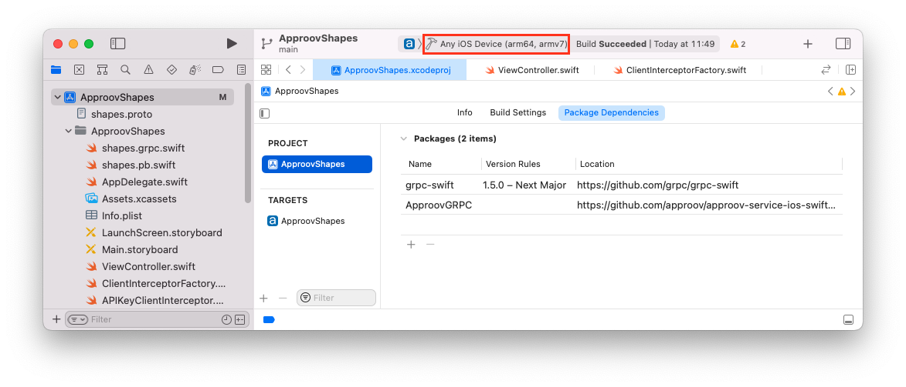

# Shapes Example

This quickstart is written specifically for native iOS apps that are written in Swift and use [GRPC-Swift](https://github.com/grpc/grpc-swift) for making the API calls that you wish to protect with Approov. This quickstart provides a step-by-step example of integrating Approov into an app using a simple `Shapes` example that shows a geometric shape based on a request to an API backend that can be protected with Approov.

## WHAT YOU WILL NEED
* Access to a trial or paid Approov account
* The `approov` command line tool [installed](https://approov.io/docs/latest/approov-installation/) with access to your account
* [Xcode](https://developer.apple.com/xcode/) version 13 installed (version 13.3 is used in this guide)
* The [protocol compiler](https://github.com/protocolbuffers/protobuf#protocol-compiler-installation), `protoc`, for Google's Protocol Buffers (version 3.18.0 is used in this guide) and the [Swift protoc plugins](https://github.com/grpc/grpc-swift#getting-the-protoc-plugins) (downloading a [binary release from GitHub](https://github.com/protocolbuffers/protobuf/releases) and installation through `homebrew` have both been used successfully with this guide)
* The contents of this repo
* An Apple mobile device with iOS 10 or higher

## RUNNING THE SHAPES APP WITHOUT APPROOV

Open the `ApproovShapes.xcodeproj` project in the `shapes-app` folder using `File->Open` in Xcode. Ensure the `ApproovShapes` project is selected at the top of Xcode's project explorer panel.

Select your codesigning certificate in the `Signing & Capabilities` tab and run the application on your prefered device.


Once the application is running you will see two buttons:

<p>
    
</p>

Press the `Hello` button and you should see this:

<p>
    
</p>

This checks the connectivity by connecting to `grpc.shapes.approov.io:50051` and making a `hello` remote procedure call. Now press the `Shape` button and you will see this:

<p>
    
</p>

This contacts `grpc.shapes.approov.io:50051` to get the name of a random shape. This remote procedure call is protected with an API key that is built into the code, and therefore can be easily extracted from the app.

The subsequent steps of this guide show you how to provide better protection, either using an Approov Token or by migrating the API key to become an Approov managed secret.

## ADD THE APPROOV SERVICE DEPENDENCY

Get the latest Approov integration by using the `Swift Package Manager`. The repository located at `https://github.com/approov/approov-service-ios-swift-grpc.git` includes as a dependency the closed source Approov SDK and includes tags pointing to the relevant Approov SDK release versions. The approov-service-ios-swift-grpc package is actually an open source wrapper layer that allows you to easily use Approov with GRPC. Install the dependency by selecting the `ApproovShapes` project in Xcode, choosing `File`, `Add Packages...` from the menu and then entering `https://github.com/approov/approov-service-ios-swift-grpc.git` into the search field of the add package dialog:


You will then have to select the relevant `ApproovGRPC` package version you wish to use; each version is identified by a tag, with the main branch usually pointing to the latest version. Select the `Exact Version` option and enter the package version, in this case `3.0.0`.
Once you click `Add Package` the last screen will confirm the package product and target selection:


Click `Add Package` again, the `ApproovGRPC` package is now included as a dependency in your project.

## ENSURE THE SHAPES API IS ADDED

In order for Approov tokens to be generated for `grpc.shapes.approov.io` it is necessary to inform Approov about it:
```
$ approov api -add grpc.shapes.approov.io
```
Tokens for this domain will be automatically signed with the specific secret for this domain, rather than the normal one for your account.

## MODIFY THE APP TO USE APPROOV

Before using Approov you need to import the `ApproovGRPC` module. In the `ViewController.swift` source file import the service module by uncommenting line 19:

```swift
// *** UNCOMMENT THE LINE BELOW FOR APPROOV ***
import ApproovGRPC
```

In the same file, locate and uncomment line 46 inside the viewDidLoad function to initialize the ApproovService. The Approov SDK needs a configuration string to identify the account associated with the app. You will have received this in your Approov onboarding email (it will be something like #123456#K/XPlLtfcwnWkzv99Wj5VmAxo4CrU267J1KlQyoz8Qo=). Copy this into the source file, replacing the text <enter-your-config-string-here>.

```swift
try! ApproovService.initialize(config: "<enter-you-config-string-here>")
```

The configuration string can also be obtained by issuing this Approov CLI command:

```
approov sdk -getConfigString
```

Uncomment the call in the `ViewController.swift` source file at line 57 and comment line 55 to create an `ApproovClientConnection.Builder` instead of a `ClientConnection.Builder`:

```swift
// let builder = ClientConnection.usingTLSBackedByNIOSSL(on: group!)
// *** UNCOMMENT THE LINE BELOW FOR APPROOV (and comment the line above) ***
let builder = ApproovClientConnection.usingTLSBackedByNIOSSL(on: group!)
let channel = builder.connect(host: hostname, port: port)
```

This creates a secure GRPC channel as normal, but also pins the connection to the endpoint to ensure that no Man-in-the-Middle can eavesdrop on any communication being made.

In `ViewController.swift`, uncomment line 125 (and comment line 123) to change the GRPC request to an `ApproovShapeRequest` for which the server will check for the presence of a valid Approov token in the request's headers before providing a result:

```swift
// Make the remote procedure call to the server.
// let shapeRPC = self.shapes!.shape(Shapes_ShapeRequest())
// *** UNCOMMENT THE LINE BELOW FOR APPROOV API PROTECTION (and comment the line above) ***
let shapeRPC = self.shapes!.approovShape(Shapes_ApproovShapeRequest())
```

In the creation of the shapes client at line 61, a ClientInterceptorFactory is passed in that provides interceptors to add an API key to selected GRPC requests:

```swift
shapes = Shapes_ShapeClient(
    channel: channel,
    interceptors: ClientInterceptorFactory(
        hostname: hostname, apiKeyHeaderName: apiKeyHeaderName, apiKey: apiSecretKey)
)
```

The interceptor factory needs to be changed so it additionally returns an `ApproovClientInterceptor` for any GRPC that requires to be protected with Approov. The `ApproovClientInterceptor` automatically fetches an Approov token and adds it as a header to any GRPC request made.

Note that this interceptor may cancel a request if it is unable to fetch an Approov token, typically due to no or poor Internet connectivity. If this happens, then the user should be able to initiate a retry. During development a cancel may occur due to a misconfiguration, see [Token Fetch Errors](https://approov.io/docs/latest/approov-usage-documentation/#token-fetch-errors).

The `ClientInterceptorFactory`'s implementation is in file `ClientInterceptorFactory.swift`. Open this file, uncomment line 19 to import the `ApproovGRPC` module

```swift
// *** UNCOMMENT THE LINE BELOW FOR APPROOV ***
import ApproovGRPC
```

and uncomment line 62 (and comment line 60) to activate the use of an ApproovClientInterceptor in any `approovShape` GRPC.

```swift
func makeApproovShapeInterceptors() -> [ClientInterceptor<Shapes_ApproovShapeRequest, Shapes_ShapeReply>] {
    let interceptors = [APIKeyClientInterceptor<Shapes_ApproovShapeRequest, Shapes_ShapeReply>(
        apiKeyHeaderName: apiKeyHeaderName, apiKey: apiKey)]
    // return interceptors
    // *** UNCOMMENT THE LINE BELOW FOR APPROOV (and comment the line above) ***
    return interceptors + ApproovClientInterceptor<Shapes_ApproovShapeRequest, Shapes_ShapeReply>(hostname: hostname)
```

Build the app again to ensure that everything is up to date.

## REGISTER YOUR APP WITH APPROOV

In order for Approov to recognize the app as being valid it needs to be registered with the service. This requires building an `.ipa` file using the `Archive` option of Xcode (this option will not be available if using the simulator). Make sure `Any iOS Device` is selected as build destination. This ensures an `embedded.mobileprovision` is included in the application package which is a requirement for the `approov` command line tool.



We can now build the application by selecting `Product` and then `Archive`. Select the apropriate code signing options and eventually a destination to save the `.ipa` file.

Copy the `ApproovShapes.ipa` file to a convenient working directory. Register the app with Approov:

```
$ approov registration -add ApproovShapes.ipa
```

## SHAPES APP WITH APPROOV API PROTECTION

Install the `ApproovShapes.ipa` that you just registered on the device. You will need to remove the old app from the device first. If you are using an emulator, you will need to learn how to ensure your device [always passes](https://approov.io/docs/latest/approov-usage-documentation/#adding-a-device-security-policy) since the simulators are not real devices and you will not be able to successfully authenticate the app.

Simply drag the `ipa` file to the device. Alternatively you can select `Window`, then `Devices and Simulators` and after selecting your device click on the small `+` sign to locate the `.ipa` file you would like to install.


Launch the app and press the `Shape` button. You should now see this (or another shape):

<p>
    
</p>

This means that the app is getting a validly signed Approov token to present to the shapes server.

## WHAT IF I DON'T GET SHAPES

If you still don't get a valid shape then there are some things you can try. Remember this may be because the device you are using has some characteristics that cause rejection for the currently set [Security Policy](https://approov.io/docs/latest/approov-usage-documentation/#security-policies) on your account:

* Ensure that the version of the app you are running is exactly the one you registered with Approov.
* If you are running the app from a debugger or simulator then valid tokens are not issued unless you have ensured your device [always passes](https://approov.io/docs/latest/approov-usage-documentation/#adding-a-device-security-policy). As a shortcut, when you are first setting up, you can add a [device security policy](https://approov.io/docs/latest/approov-usage-documentation/#adding-a-device-security-policy) using the `latest` shortcut as discussed so that the `device ID` doesn't need to be extracted from the logs or an Approov token.
* Look at the [`syslog`](https://developer.apple.com/documentation/os/logging) output from the device. Information about any Approov token fetched or an error is logged. You can easily [check](https://approov.io/docs/latest/approov-usage-documentation/#loggable-tokens) the validity.
* Consider using an [Annotation Policy](https://approov.io/docs/latest/approov-usage-documentation/#annotation-policies) during development to directly see why the device is not being issued with a valid token.
* Use `approov metrics` to see [Live Metrics](https://approov.io/docs/latest/approov-usage-documentation/#live-metrics) of the cause of failure.
* Inspect any exceptions for additional information

## SHAPES APP WITH SECRETS PROTECTION

This section provides an illustration of an alternative option for Approov protection if you are not able to modify the backend to add an Approov token check. We revert to using a `shapes` GRPC that simply checks for an API key, so please undo the code changes made to ViewController.swift at lines 123-125:

```swift
let shapeRequest = Shapes_ShapeRequest()
// *** UNCOMMENT THE LINE BELOW FOR APPROOV API PROTECTION (and comment the line above) ***
// let shapeRequest = Shapes_ApproovShapeRequest()
```

The value of `apiSecretKey` variable needs to be changed to `"shapes_api_key_placeholder"`, removing the actual API key from the code in ViewController.swift, lines 35-37:

```swift
// let apiSecretKey = "yXClypapWNHIifHUWmBIyPFAm"
// *** UNCOMMENT THE LINE BELOW FOR APPROOV SECRETS PROTECTION (and comment the line above) ***
let apiSecretKey = "shapes_api_key_placeholder"
```

We also need to inform the `ApproovService` module that it needs to substitute the placeholder value for the real API key on the `Api-Key` header. Find line 67 and uncomment it as shown:

```swift
// *** UNCOMMENT THE LINE BELOW FOR APPROOV SECRETS PROTECTION ***
ApproovService.addSubstitutionHeader(header: apiKeyHeaderName, prefix: nil)
```

This processes the headers and replaces in the actual API key as required.

In `ClientInterceptorFactory.swift` uncomment line 54 (and comment line 52) to activate the use of an ApproovClientInterceptor in any `shape` GRPC.

```swift
// return interceptors
// *** UNCOMMENT THE LINE BELOW FOR APPROOV SECRETS PROTECTION (and comment the line above) ***
return interceptors + [ApproovClientInterceptor<Shapes_ShapeRequest, Shapes_ShapeReply>(hostname: hostname)]
```

Next we enable Approov's [Secure Strings](https://approov.io/docs/latest/approov-usage-documentation/#secure-strings) feature:

```
approov secstrings -setEnabled
```

> Note that this command requires an [admin role](https://approov.io/docs/latest/approov-usage-documentation/#account-access-roles).

You must inform Approov that it should map `shapes_api_key_placeholder` to `yXClypapWNHIifHUWmBIyPFAm` (the actual API key) in requests as follows:

```
approov secstrings -addKey shapes_api_key_placeholder -predefinedValue yXClypapWNHIifHUWmBIyPFAm
```

> Note that this command also requires an [admin role](https://approov.io/docs/latest/approov-usage-documentation/#account-access-roles).

Build and run the app again to ensure that the `ApproovShapes.ipa` in the generated build outputs is up to date. You need to register the updated app with Approov. Using the command line register the app with:

```
approov registration -add ApproovShapes.ipa
```

Run the app again without making any changes to the app and press the `Shape` button. You should now see this (or another shape):

<p>
    
</p>

This means that the registered app is able to access the API key, even though it is no longer embedded in the app code, and provide it to the shapes request.
